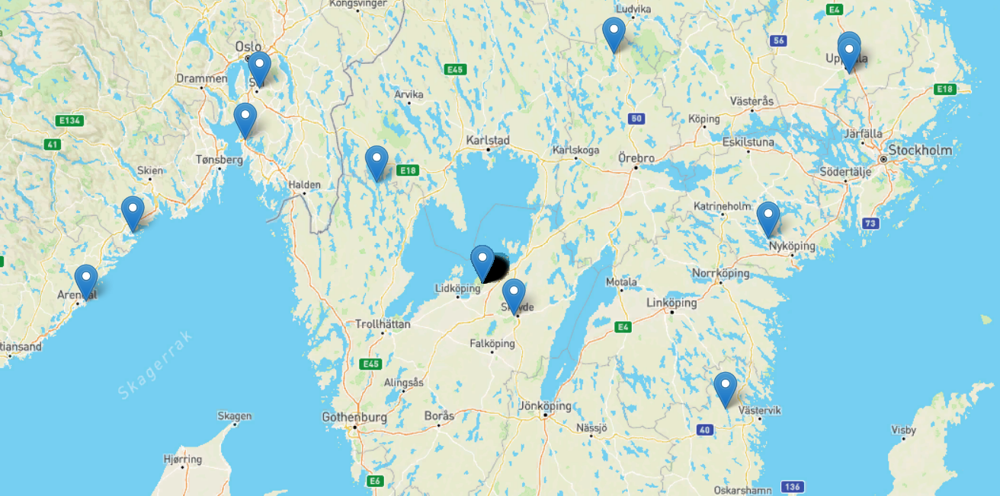
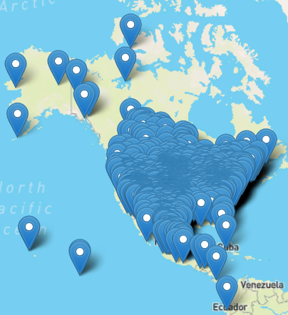
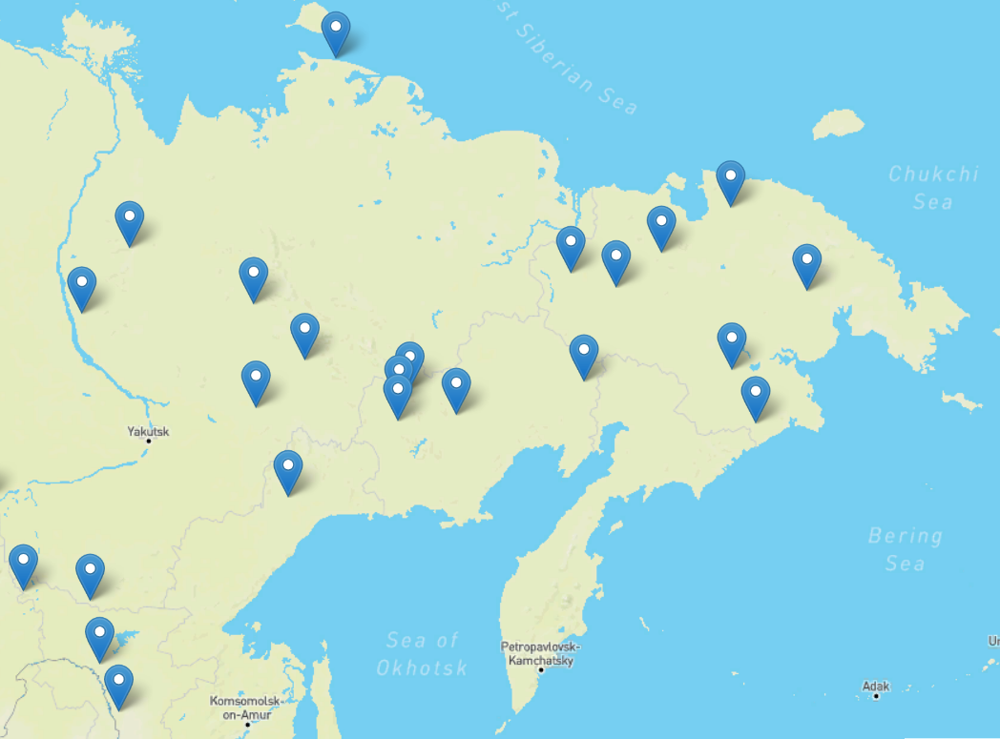

# Аспекты учета и поиска геоинформационных объектов с задействованием возможностей документоориентированной базы данных MongoDB.

__Онлайн-курс__: <a target="blank" href="https://otus.ru/lessons/nosql-bd/">"OTUS.NoSQL"</a>.

__Период обучения:__ 30 сентября 2020 года — 4 апреля 2021 года.

<p style='text-align: right;'> «Лучше один раз увидеть, чем сто раз услышать!» (<i>пословица</i>)</p>

## Введение

**Геоинформация** - это любые сведения, отражающие расположение, форму и размеры объекта (далее - гео-объект). Ее учет ведется в картографии, геологии, метеорологии, землеустройстве, экологии, муниципальном управлении, транспорте, экономике, обороне и многих других областях. Геоинформация является неотъемлемой частью так называемых Больших данных, что приводит к необходимости разработки средств ее анализа и визуализации. 

> Академический подход написания статей подразумевал "сведения, отражающие свойства ... объектов материального мира". Однако на практике имелся факт осуществления энтузиастом накладки поверх Гугл-карт через штатное API рисунков с топографией Средиземья и построение маршрутов героев Дж. Толкина, что не совсем "материально". Другим стыком с нематериальным может служить пример наборов данных по типу [GeoIP](https://www.maxmind.com/en/geoip-demo), [E.164](https://ru.wikipedia.org/wiki/E.164), [ABC](https://ru.wikipedia.org/wiki/Телефонный_план_нумерации_России#Список_географических_кодов).

Результат исследования представляет собой инструмент отображения хранящихся в MongoDB сведений о гео-объектах на карте посредством web-доступа. Клиентская часть реализована с использованием [Leaflet](https://leafletjs.com/) (JavaScript-библиотека с открытым исходным кодом для мобильных интерактивных карт) и набора соответствующих процедур асинхронного получения сведений от серверной части. Сервис разработан на базе созданного ранее на курсе ["OTUS.Web-python"](https://otus.ru/lessons/webpython/) конструктора программного обеспечения ["Dummy WSGI Framework"](https://pypi.org/project/dummy_wsgi_framework/) ([репозиторий](https://github.com/BorisPlus/dummy_wsgi_framework)) на языке программирования Python3 с задействованием WSGI. 

В настоящем тексте основное внимание уделено простоте работы с геоинформацией средствами MongoDB. Особенности реализации процедур сбора демонстрационных сведений отражены по мере изложения.

Необходимо заметить, что документация [MongoDB](https://docs.mongodb.com/manual/) является достаточно проработанной и удобной по навигации. Исчерпывающие сведения в разделе по [гео-объектам](https://docs.mongodb.com/manual/geospatial-queries/) подтолкнули к изучению изложенных в данной работе возможностей. Кроме того, после осуществленной разработки и достигнутых результатов в ходе написания настоящего текста в документации MongoDB обнаружен [пример](https://docs.mongodb.com/manual/tutorial/geospatial-tutorial/) работы с гео-объектами, что еще раз подтверждает ее высокую проработку.

## Гео-объекты MongoDB

В данной статье продемонстрированы базовые возможности оперирования в MongoDB такими [гео-объектами](https://docs.mongodb.com/manual/reference/geojson/) как: [точка](https://docs.mongodb.com/manual/reference/geojson/#point), [линия](https://docs.mongodb.com/manual/reference/geojson/#linestring), [полигон](https://docs.mongodb.com/manual/reference/geojson/#polygon). 

> Более сложные структуры, такие как: [набор точек](https://docs.mongodb.com/manual/reference/geojson/#multipoint), [набор линий](https://docs.mongodb.com/manual/reference/geojson/#multilinestring), [набор полигонов](https://docs.mongodb.com/manual/reference/geojson/#multipolygon) и [коллекция гео-объектов](https://docs.mongodb.com/manual/reference/geojson/#geometrycollection) не рассматриваются. 

Представляемое в рамках настоящей работы решение предполагает возможность хранения в обособленных коллекциях одной базы данных сведений о гео-объектах различных типов. Тем не менее хранение также возможно в рамках одной коллекции. Названия полей, описывающих гео-объекты, могут быть произвольными, за исключением уникально идентифицирующего атрибута документа - `ident`. Также необходимо соблюдать установленную MongoDB [структуру сведений](https://docs.mongodb.com/manual/geospatial-queries/#geojson-objects) о гео-объекте:

```
<field>: { type: <GeoJSON type> , coordinates: <coordinates> }
```

В рамках получения сведений клиентской стороной от серверной гео-объекты искусственно поделены на два вида - статичные и динамичные.

Под статичными понимаются те, свойства которых фиксированы, и, таким образом, актуализация сведений в отношении которых не требуется, в том числе при изменении позиции наблюдения. В ранней <a href="https://habr.com/ru/post/523182/" target="_blank">статье</a> к данной категории относились метеориты. С целью демонстрации возможностей работы с полигонами к ним добавлены - здания и сооружения (собраны для отдельного района г. Санкт-Петербурга).

Динамичные гео-объекты - это те, положение, форма или размер которых изменяются с течением времени даже при неизменной позиции наблюдателя. В качестве демонстрации возможности работы с таковыми осуществляется фоновый сбор перемещений таксопарка компании "Яндекс", представляемых на карте в виде части пути (линия из нескольких крайних точек пройденного маршрута) и текущих мест пребывания (точка).

> Предполагается, что инфраструктура MongoDB развернута. 
> 
> ```mongodb
> mongo  192.168.102.99  --port 49326
> ---
> > use otus
> switched to db otus
> > db.dropDatabase()
> { "dropped" : "otus", "ok" : 1 }
> > use otus
> switched to db otus
> > db
> otus
> > show collections
> ```

### Точки (статичные)

В качестве [точек](https://docs.mongodb.com/manual/reference/geojson/#point) используются [метеориты](https://data.nasa.gov/Space-Science/Meteorite-Landings/gh4g-9sfh). Необходимые коллекция, поля и индексы:

```mongodb
> db.meteorites.createIndex( { "ident": 1 }, { unique: true } )
> db.meteorites.createIndex( { "location" : "2dsphere" } ) 
```

Изначально сведения о местоположении хранятся в атрибуте `geolocation`. Однако оно не имеет необходимой структуры для гео-объекта типа "точка". Поэтому в качестве атрибута местоположения метеоритов выступает дополнительное, отсутствующее в демонстрационном наборе, поле `location`, куда перенесены сведения в необходимом формате:

```
location: { type: 'Point' , coordinates: [ LON, LAT ] }
```

Загрузка исходных данных о метеоритах: 

```shell
mongoimport --host 192.168.102.99  --port 49326 \
--db otus --collection meteorites --jsonArray \
--file ./foreign/meteorites/data.json

    2021-03-28T10:28:09.443+0300    connected to: mongodb://192.168.102.99:49326/
    2021-03-28T10:28:12.443+0300    [###.....................] otus.meteorites      1.62MB/10.1MB (16.0%)
    2021-03-28T10:28:15.443+0300    [#########...............] otus.meteorites      3.97MB/10.1MB (39.4%)
    2021-03-28T10:28:18.443+0300    [############............] otus.meteorites      5.39MB/10.1MB (53.4%)
    2021-03-28T10:28:21.443+0300    [#################.......] otus.meteorites      7.23MB/10.1MB (71.6%)
    2021-03-28T10:28:24.443+0300    [#####################...] otus.meteorites      8.83MB/10.1MB (87.5%)
    2021-03-28T10:28:27.443+0300    [#######################.] otus.meteorites      9.71MB/10.1MB (96.3%)
    2021-03-28T10:28:28.453+0300    [########################] otus.meteorites      10.1MB/10.1MB (100.0%)
    2021-03-28T10:28:28.454+0300    45716 document(s) imported successfully. 0 document(s) failed to import.
```

Исходя из уже имеющегося опыта, из набора 45716 объектов необходимо удалить метеорит, который не относится к земной поверхности (марсианский метеорит [Meridiani Planum](http://old.mirf.ru/Articles/art2427_2.htm)), так как его координаты не соответствуют стандарту земного геопозиционирования и не могут быть помещены в индекс (индексирование приводит к ошибке `Can't extract geo keys: ... longitude/latitude is out of bounds, ...`, равно как и вставка таких данных в индекс).

```mongodb
db.meteorites.remove({"ident" : "32789"});
```

Кроме этого в наборе имеется 7315 метеоритов, чье местоположение не известно. Данный факт также не позволит включить их в гео-индекс и приведет к ошибке. Поэтому в индексе учтены только те метеориты, чье местоположение известно.

```mongodb
db.meteorites.updateMany( 
    {"geolocation":{$exists:true}},
    [{
        $set: {
            "location" : {
                "type": "Point",
                "coordinates" : [ 
                    { $toDouble: "$geolocation.longitude" } , 
                    { $toDouble: "$geolocation.latitude" } 
                ]
            }
        }
    }]
);
```

В результате в MongoDB в коллекции `meteorites` в атрибутах `location` содержится информация о местоположении 38400 метеоритах из их общего числа 45716. 

**Важное замечание:** согласно [документации](https://docs.mongodb.com/manual/geospatial-queries/#geospatial-data) данный порядок следования координат `{ долгота, широта }` является единственно верным с точки зрения MongoDB (`If specifying latitude and longitude coordinates, list the longitude first and then latitude`). Необходимо заострить внимание на этом обстоятельстве, так как в последующем при отображении информации на карте Leaflet нужен будет другой [порядок](https://leafletjs.com/reference-1.7.1.html#latlng) абсолютно для всех координат любых гео-объектов - `{ широта, долгота }`. Указанное приводит к тому, что после получения сведений из MongoDB требуется произвести перестановку в парах координат или представить их в виде "словаря" `{ lon: долгота, lat: широта }`. Если для точки это выражается в одной перестановке, то для полигона это происходит в рамках итерации по точкам границы. Было бы хорошо, если бы MongoDB поддерживала хранение и в формате `{ широта, долгота }`. 

### Полигоны (статичные)

В качестве [полигонов](https://docs.mongodb.com/manual/reference/geojson/#polygon) используются здания и сооружения, сведения о которых единоразово получены для отдельного района г. Санкт-Петербурга с использованием API сервиса [WikiMapia](https://wikimapia.org/api/).

> WikiMapia имеет лимит по числу запросов, при превышении которого сведения информационным ресурсом не предоставляются (при этом указанное не приводит к возникновению ошибки, что затрудняет понимание в фактическом наличии подобных данных). Данное обстоятельство нивелируется возможностью (предположительно неограниченного) получения дополнительных API-ключей доступа.

Коллекции и необходимые для работы индексы.

```mongodb
db.geo_wikimapia_polygons.createIndex( { "ident": 1 }, { unique: true } )
db.geo_wikimapia_polygons.createIndex( { "area" : "2dsphere" } ) 
```

[Сбор](./foreign/onetime_static_load_polygons_wikimapia.py) демонстрационных данных реализован на языке программирования Python3 с использованием библиотеки `pymongo`.

> __Вниманию Python-разработчиков__: в исходном коде данной процедуры исключено исполнение набора инструкций вставки-обновления (`UPSERT`) за раз (`bulk_write(instructions)`), так как при наличии ошибки (о чем сказано ниже) соответственно он отвергался полностью. Вставка-обновление происходит последовательно по одной инструкции.

Изначально сведения о местоположении полигона разнесены по полям записи, то есть фактически отсутствует атрибут необходимой для MongoDB структуры для гео-объекта типа "полигон". Поэтому в его качестве выступает дополнительное поле `area`, куда перенесены сведения в необходимом формате (происходит сразу при [вставке](./foreign/onetime_static_load_polygons_wikimapia.py) сведений в рамках их онлайн-получения). Структура гео-типа `полигон` имеет вид: 

```
area: { type: 'Polygon' , coordinates: [[ [LON_1, LAT_1], [LON_2, LAT_2], ..., [LON_1, LAT_1] ]] }
```

В результате запросов к WikiMapia:

```shell
python3 ./foreign/onetime_static_load_polygons_wikimapia.py 

    Page 1 has docs count 50
    Page 2 has docs count 50
    ...
    Page 37 has docs count 35
    Max page 37 with some data
```

в MongoDB накоплена информация в отношении:

```mongodb
> db.geo_wikimapia_polygons.count()
```

1832 зданий и сооружений.  

**Важное замечание**: в MongoDB сведения о полигоне должны удовлетворять спецификации ([пункт 3.1.6 RFC 7946 "GeoJSON" August 2016](https://tools.ietf.org/html/rfc7946#section-3.1.6)). В частности, полигон, имеющий пересечение граней, не может быть добавлен (иначе в MongoDB возникает ошибка `Edges <number K> and <number M> cross. Edge locations in degrees: [Kx1, Ky1]-[Kx2, Ky2] and [Mx1, My1]-[Mx2,My2]`). Кроме того, важно, чтобы полигон был "замкнут", то есть крайняя точка должна совпадать и первоначальной (иначе в MongoDB возникает ошибка `Loop is not closed`). WikiMapia же иным образом походит к требованиям достоверности координат полигонов. Поэтому из 1835 полигонов, полученных в описанном ранее абзаце (36 страниц * 50 полигонов + 35 полигонов = 1835 полигонов), сохранены 1832 объекта. 

### Линии (динамичные) 

В качестве демонстрационных динамичных гео-объектов выбраны [линии](https://docs.mongodb.com/manual/reference/geojson/#linestring) и точки, отражающие крайние части маршрутов и фактическое пребывание автомобилей таксопарка компании "Яндекс" соответственно.

**Важное замечание**: сведения о линии должны удовлетворять спецификации ([пункт 3.1.4 RFC 7946 "GeoJSON" August 2016](https://tools.ietf.org/html/rfc7946#section-3.1.4)), то есть линия должна содержать две разные точки (при этом она может также содержать и одинаковые).

Сбор демонстрационных данных [реализован](./foreign/upsert_yandex_taxi_loop.py) на языке программирования Python3 с использованием библиотек `requests`, `pymongo` и задействованием пакета многопроцессорной обработки `multiprocessing`. Необходимость крайнего обусловлена требованиями увеличения скорости получения актуальных сведений о местоположении и пути следования автомобилей с целью повышения эффективности частоты прорисовки маршрутов на карте (максимизации интерактивности). Сведения получаются в отношении заранее определенных точек района г. Санкт-Петербурга. Точки сбора данной информации располагаются на определенном коротком расстоянии друг от друга и образуют заранее рассчитанную в проекте "ячеистую" структуру. Данный подход отличается от [алгоритма "заливки"](https://habr.com/ru/post/480956/), применявшегося иным разработчиком, исследовавшим подобную информацию ранее.

> __Вниманию Python-разработчиков__: невозможно организовать пул процессов, к которым применены декораторы. Необходимо переписать код таких функций с условием внесения в их содержание "оберточной" логики.

Изначально сведения о маршруте не имеют необходимой MongoDB структуры для гео-объекта типа "линия". Поэтому в качестве данного атрибута выступает дополнительное поле `area`, куда перенесены сведения в необходимом формате. Структура гео-типа `линия` имеет вид: 
```
path: { type: 'LineString' , coordinates: [[ [LON_1, LAT_1], [LON_2, LAT_2], ..., [LON_N, LAT_N] ]] }
```

## Операции с гео-объектами

В рамках работы рассматриваются такие [операции](https://docs.mongodb.com/manual/geospatial-queries/#geospatial-query-operators) как: `$geoIntersects` и `$nearSphere`. 

Операция [$geoIntersects](https://docs.mongodb.com/manual/reference/operator/query/geoIntersects/#op._S_geoIntersects) является основной реализованной в проекте и используется для нахождения всех гео-объектов, имеющих пересечение по гео-расположению с текущей областью карты. Например, если в область карты (соответствующий полигон, описываемый двумя крайними диаметрально расположенными координатами) попадет часть маршрута (линии) или часть здания (полигона), то они будут получены из базы данных и отображены на карте. Точки, соответственно, появятся при их попадании в данную область. 

**Важное замечание**: при строгом подходе и оценке данного исследования можно утверждать, что оно фактически основано на единственном запросе "найти все объекты в области на карте". Однако, в рамках защиты необходимо заметить, что конечной целью являлась демонстрация именно простоты работы с геоинформацией в MongoDB.  

Использование иной операции [$nearSphere](https://docs.mongodb.com/manual/reference/operator/query/nearSphere) продемонстрировано на примере выборки из MongoDb полигонов и метеоритов с целью отображения их на карте только при условии присутствия их в "круговой" окрестности наблюдения (для полигона - пересечение с окружностью). 
       
Операции [$geoWithin](https://docs.mongodb.com/manual/reference/operator/query/geoWithin/) (выборка гео-объектов, имеющих полное включение в заданную область) и [$near](https://docs.mongodb.com/manual/reference/operator/query/near/) (выборка гео-объектов в окрестности точки) в рамках настоящей работы не рассматриваются.

> Операции `$near` и `$nearSphere` шире по возможности, чем просто "нахождение в круговой окрестности", так как описывают не только максимальное удаление (`$maxDistance`) от точки наблюдения, но и минимальное (`$minDistance`). Данное обстоятельство может быть использовано при работе с секторами, учитывающими "примерное" удаление объектов от исходной точки наблюдения: секторное поле зрения на панораме "Яндекс.Карты", "классические" области действия сотовых вышек, углы обзора видеокамер городского наружного наблюдения и иное.

## Сервис демонстрации гео-объектов

Сервис реализован на базе авторского конструктора программного Web-обеспечения ["Dummy WSGI Framework"](https://pypi.org/project/dummy_wsgi_framework/) ([репозиторий](https://github.com/BorisPlus/dummy_wsgi_framework)), является легковесным (45 килобайт кода).

```shell
pip3 install -r ./service/requirements.txt
uwsgi --http 127.0.0.1:8080 --wsgi-file ./service/application.py
```

### Обстановка в области карты

По адресу http://127.0.0.1:8080 вниманию представлен район г. Санкт-Петербурга, где отображены полигоны зданий. По мере перемещения по карте или изменении масштаба карты в асинхронном режиме подгружаются иные полигоны.

> Разработчикам на заметку: для записи GIF-анимации использовалось программное обеспечение [Peek](https://github.com/phw/peek).


При перемещении в определенные районы (достаточно в исходной точке г. Санкт-Петербурга уменьшить масштаб до размера "7") подгружаются указатели на конкретные места падения метеоритов. 


С целью демонстрации в текущем приложении нет ограничения на степень масштабирования, при которой запросы к серверной части не происходят. Тем самым представляется возможным увидеть скопления метеоритов на карте достаточно малого масштаба. Однако в качестве рекомендаций при работе с данными, имеющими значительный "мировой" объем, можно посоветовать использование имеющегося в Leaflet параметра минимально допустимого уровня масштабирования карты.

Очередным открытием в данных NASA явилось наличие 64 метеоритов, местоположения падения которых имеют (абсолютно) одинаковые координаты. Указанное обнаружено в результате визуального изучения метеоритов на карте (выделяющаяся темная тень).



```mongodb
> db.meteorites.find({"location.coordinates": [13.43333,58.58333] }).count()
    64
> db.meteorites.find({"location.coordinates": [13.43333,58.58333] }, {name: 1, _id: 0})
    { "name" : "Osterplana" }
    { "name" : "Österplana 002" }
    { "name" : "Österplana 003" }
    ...
    { "name" : "Österplana 064" }
```

Данные "необычные" сведения соответствуют метеориту "Österplana", имеющему удивительную [историю](https://en.wikipedia.org/wiki/Österplana_065). 

Для интерактивной демонстрации динамичных гео-объектов необходима следующая коллекция:

```mongodb
db.geo_yandex_taxi.deleteMany({})
db.geo_yandex_taxi.createIndex( { "ident": 1 }, { unique: true } )
db.geo_yandex_taxi.createIndex( { "last_point" : "2dsphere" } )
db.geo_yandex_taxi.createIndex( { "path" : "2dsphere" } )
```

и фоновый сбор актуальных данных:

```
python3 ./foreign/upsert_yandex_taxi_loop.py 

    9       2.6140940189361572
    9       2.481816291809082
    9       2.528238296508789
    9       2.374605894088745
    9       2.5337154865264893
    9       2.7297616004943848
    9       2.60577392578125
    9       2.586944818496704
    9       2.5660433769226074
```

Исходные сведения о перемещении таксопарка "Яндекс" обезличены и содержат крайние точки пройденных маршрутов:

```
{'id': 'bcc095db8e3b56e057caebdb97af5694', 'display_tariff': 'business', 'free': True, 'static_icon': False, 
'positions': [{'lon': 30.326291, 'lat': 59.974395, 'direction': 50.0, 'timestamp': '2021-03-24T23:49:01.000000+0000'}, 
{'lon': 30.326291, 'lat': 59.974395, 'direction': 50.0, 'timestamp': '2021-03-24T23:48:52.000000+0000'}, 
{'lon': 30.326291, 'lat': 59.974395, 'direction': 50.0, 'timestamp': '2021-03-24T23:48:43.000000+0000'}, 
{'lon': 30.326291, 'lat': 59.974395, 'direction': 50.0, 'timestamp': '2021-03-24T23:48:34.000000+0000'}]}
```

> Формат данных предположительно свидетельствует о том, что с целью повышения скорости предоставления крайних позиций автомобилей система "Яндекс" ориентирована на хранение ненормализованного вида соответствующих сведений.

На их основании сформированы линия перемещения и точка крайнего местоположения.


Помимо мониторинга на предмет появления нового динамичного объекта в текущей области карты системой осуществляется проверка покидания объектами ее границ. В ином бы случае движущиеся объекты останавливались и скапливались по краям карты.


### Обстановка в области круговой окрестности

По адресу [http://localhost:8080/circle/](http://localhost:8080/circle/) продемонстрирована выборка только тех гео-объектов, которые попадают в круговую окрестность, располагаемую по центру карты.


**Важное замечание**: с целью использования `near` и `nearSphere` требуется создать индекс `2d` или `2dsphere`, иначе их вызов приведет к ошибке исполнения:

```
error processing query: ns=otus.geo_wikimapia_polygonsTree: GEONEAR  field=area maxdist=500 isNearSphere=0
Sort: {}
Proj: { _id: 0 }
 planner returned error :: caused by :: unable to find index for $geoNear query, full error: {'ok': 0.0, 'errmsg': 'error processing query: ns=otus.geo_wikimapia_polygonsTree: GEONEAR  field=area maxdist=500 isNearSphere=0\nSort: {}\nProj: { _id: 0 }\n planner returned error :: caused by :: unable to find index for $geoNear query', 'code': 291, 'codeName': 'NoQueryExecutionPlans'}
```

## Технические особенности реализации

При использовании данных наработок помимо перечисленных аспектов необходимо учитывать следующее.

### Конфигурационный файл

Параметр конфигурации сервиса [`base_config.py`](./base_config.py) содержит отсылку на вид ("статичный", "динамичный"), название коллекции базы MongoDB ("meteorites", "geo_wikimapia_polygons", "geo_yandex_taxi") и атрибуты ("location", "area", "last_point", "path"), содержащие сведения о гео-объектах с указанием их GeoJSON-типа ("Point", "LineString", "Polygon"), а именно:

```python3
...
MONGODB_DB_COLLECTIONS = dict(
    static={
        "meteorites": {
            "location": POINT_OBJECT,
        },
        "geo_wikimapia_polygons": {
            "area": POLYGON_OBJECT,
        },
    },
    dynamic={
        "geo_yandex_taxi": {
            "last_point": POINT_OBJECT,
            "path": LINE_STRING_OBJECT,
        },
    },
)
...
```

Таким образом, при необходимости отображения на карте сведений из иной коллекции необходимо определиться с их видом ("статичный", "динамичный"), типом ("точка", "линия", "полигон") и названием конкретного атрибута, где они сохранены в требуемой MongoDB структуре. 

При отсутствии в конфигурации динамичной коллекции, генерируемая сервисом HTML-страница не содержит инструкцию на JavaScript, осуществляющую периодический запрос сведений при неизменной локации. Указанное устраняет излишнюю нагрузку на серверную часть сервиса.

Изменения конфигурации вступают в силу после перезапуска сервиса, работа исключительно с HTML-файлами данных действий не требует.

### "Ненагружающий" запоздалый AJAX запрос

Получение сведений клиентской частью от серверной реализовано с использованием асинхронных запросов на JavaScript (AJAX). При этом с целью недопущения исполнения сервисом запросов, являющихся "промежуточными", запросы происходят с некоторой малой задержкой, во время которой данный запрос может быть отменен последующим обращением. То есть результативная выборка данных происходит только в конечном положении наблюдения. Данный подход снижает нагрузку на серверную часть при последовательном переходе от участка карты к участку или при работе с ее масштабированием за счет исключения к ней AJAX-запросов, фактическое исполнение которых не требуется.

```js
 function get_data(...){
    ...
    if (xhr && !(xhr.readyState === 4)) {
        xhr.abort();
        console.log('Previous AJAX #' + xhr.__dt + ' was aborted');
    }
    clearTimeout(timer);
    xhr = new XMLHttpRequest();
    xhr.responseType = 'json';
    xhr.__dt = Date.now();
    console.log('Start AJAX #' + xhr.__dt);
    timer = setTimeout(function() {
        // find objects in area.
    }
}
```

Работа по старту AJAX-запроса и его прерыванию, если браузер осуществил новое обращение, продемонстрирована ниже. 

. 

## Направления работы

### Соответствие координат

MongoDB использует систему координат WGS84 ([`MongoDB geospatial queries on GeoJSON objects calculate on a sphere; MongoDB uses the WGS84 reference system for geospatial queries on GeoJSON objects`](https://docs.mongodb.com/manual/geospatial-queries/#geojson-objects)), [из глоссария](https://docs.mongodb.com/manual/reference/glossary/#term-wgs84)).

При этом Leaflet по-умолчанию использует систему координат [EPSG 3857]([https://leafletjs.com/reference-1.7.1.html#crs-l-crs-epsg3857]).

Исходя из описания, [EPSG 3857](https://epsg.io/3857) допустима для координат между `85.06°S` и `85.06°N`. 

То есть в рамках рабочей эксплуатации необходимо в Leaflet установить параметр CRS равным ["L.CRS.EPSG4326"](https://leafletjs.com/reference-1.7.1.html#crs-l-crs-epsg4326), поскольку [он](https://epsg.io/4326) не имеет таких ограничений и целиком соответствует системе геокодирования MongoDB.

### Запредельные координаты

К сожалению в данной работе не решен нюанс запроса сведений в области карты, находящейся за пределами стандартных для MongoDB широты и долготы. Например, после изначальной загрузки карты возможно осуществить значительное ее перетаскивание в сторону, и тем самым Leaflet станет запрашивать сведения, подобные этим:

```
pymongo.errors.OperationFailure: longitude/latitude is out of bounds, lng: 561.213 lat: 89.9823 ... 

Valid longitude values are between -180 and 180, both inclusive.
Valid latitude values are between -90 and 90, both inclusive.
```

Данный момент возможно решить, если проводить "нормирование" запрашиваемой области (операции по типу остатка от деления, поиск соответствия "нормальному" двумерному "интервалу"), а при отображении на карте - "денормирование" координат полученных гео-объектов (в зависимости от смещения относительно них периметра карты).

### β-тестирование

В рамках работы не рассматривались вопросы шардирования сведений о гео-объектах (операции их [поддерживают в MongoDB](https://docs.mongodb.com/manual/geospatial-queries/#geospatial-indexes-and-sharded-collections) у версий выше 4.0) и не исследовалась отдача при нагрузке. 

### Расширение числа источников

В результате рефакторинга представляется возможной организация получения сведений не только из разных коллекций, как это реализовано в настоящее время, но и от разных баз данных MongoDB. Указанное значительно повысит гибкость использования разработанного инструмента.

## Выводы

Необходимо заметить, что Leaflet через браузер позволяет осуществить запрос у пользователя его текущих координат. Таким образом, достигнутый результат позволяет организовать на его базе ядро практически любого онлайн-сервиса - от работы с привычными статичными объектами (банкоматы, столовые, места общего пользования, остановки городского транспорта, места подзарядки телефонов) до мониторинга динамичных (друзья рядом, грузо-пассажирский [транспорт](https://www.flightradar24.com/), погодный (температура, осадки) фронт). 

## Вместо заключения

Спасибо курсам <a target="_blank" href="https://otus.ru/">"OTUS"</a> за приобретенный опыт Fullstack-разработки (в частности интеграции Python, Javascript и MongoDB).

<p style='text-align: right;'> «Лучше один раз увидеть, чем сто раз услышать!» (<i>пословица</i>)</p>



 

